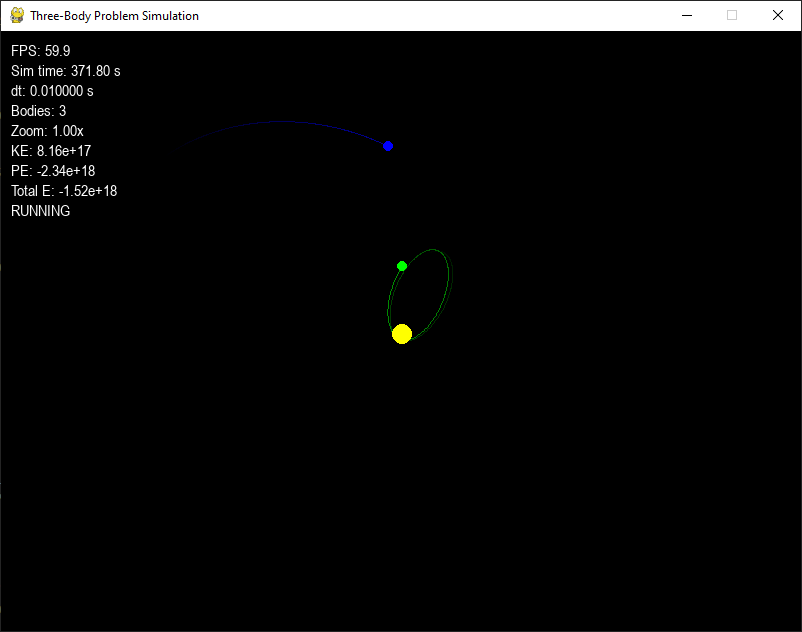

# Three-Body Problem Simulation (2D)

A Python simulation of the classical three-body problem in a 2D plane using Pygame.



## Repository

This project is available on GitHub: [https://github.com/ilyakudas/3body2d](https://github.com/ilyakudas/3body2d)

## Overview

This project simulates the gravitational interactions between three bodies in a two-dimensional space. It visualizes the complex and often chaotic motion that emerges from the simple Newtonian laws of gravitation.

## Features

- Real-time visualization of three gravitating bodies in 2D space
- Interactive controls for pausing, resetting, and adjusting simulation parameters
- Adjustable camera with zoom and pan functionality
- Visualization of body trails showing orbital paths
- Energy conservation monitoring
- Configurable initial conditions via JSON

## Requirements

- Python 3.10 or higher
- Pygame 2.5 or higher
- NumPy (optional, for improved performance)

## Installation

```bash
# Clone the repository
git clone https://github.com/yourusername/3body2d.git
cd 3body2d

# Install dependencies
pip install -r requirements.txt
```

## Usage

To run the simulation:

```bash
python main.py
```

Optional command-line arguments:

- `--config`: Path to a custom configuration file (default: `config.json`)
- `--fullscreen`: Launch in fullscreen mode
- `--width`: Window width (default: 1280)
- `--height`: Window height (default: 720)

## Controls

- **Space**: Pause/resume simulation
- **R**: Reset simulation to initial state
- **+/-**: Increase/decrease simulation speed
- **Mouse wheel**: Zoom in/out
- **Mouse drag**: Pan camera
- **S**: Save current simulation state
- **L**: Load saved simulation state
- **ESC**: Quit

## Physics Engine

The simulation uses a Velocity Verlet integrator by default for accurate energy conservation. The physics engine has been validated through unit tests to ensure:

1. **Force Symmetry**: Forces between bodies are equal and opposite
2. **Force Magnitude**: Gravitational forces follow Newton's law of universal gravitation
3. **Energy Conservation**: Total system energy is conserved within acceptable limits

For two-body systems, energy drift is maintained below 1% over 1000 steps. For three-body systems, energy drift is maintained below 2% due to the inherent chaotic nature of such systems.

In extended validation tests with our default configuration, energy drift was measured at only 0.005% over 10,000 steps, demonstrating excellent numerical stability.

You can switch between integration methods (Euler or Velocity Verlet) in the configuration file.

## Configuration

Edit `config.json` to customize the simulation parameters:

```json
{
  "bodies": [
    {
      "mass": 1.0e6,
      "position": [0, 0],
      "velocity": [0, 0],
      "radius": 10,
      "color": [255, 255, 0]
    },
    ...
  ],
  "physics": {
    "G": 6.674e-11,
    "dt": 0.01,
    "integrations_per_frame": 10
  },
  "display": {
    "width": 800,
    "height": 600,
    "trail_length": 500
  }
}
```

## Contributing

Contributions are welcome! Here's how you can help improve this project:

1. **Fork** the repository
2. **Create** a feature branch: `git checkout -b feature/amazing-feature`
3. **Commit** your changes: `git commit -m 'Add some amazing feature'`
4. **Push** to the branch: `git push origin feature/amazing-feature`
5. **Submit** a pull request

Before submitting, please ensure:
- All unit tests pass: `python -m unittest discover tests`
- Your code follows the project's style guidelines
- You've added tests for new features
- Documentation is updated as needed

### Development Notes

- The simulation architecture is modular, with separate components for physics, rendering, and UI
- The `config.json` file allows for easy customization of simulation parameters
- Performance optimizations are welcome, especially for larger N-body systems

## License

[MIT License](LICENSE)

## Acknowledgements

- Based on Newtonian mechanics and numerical integration techniques
- Visualization powered by Pygame
- The three-body problem for being an endless source of fascination
- The scientific community for ongoing research into N-body dynamics
